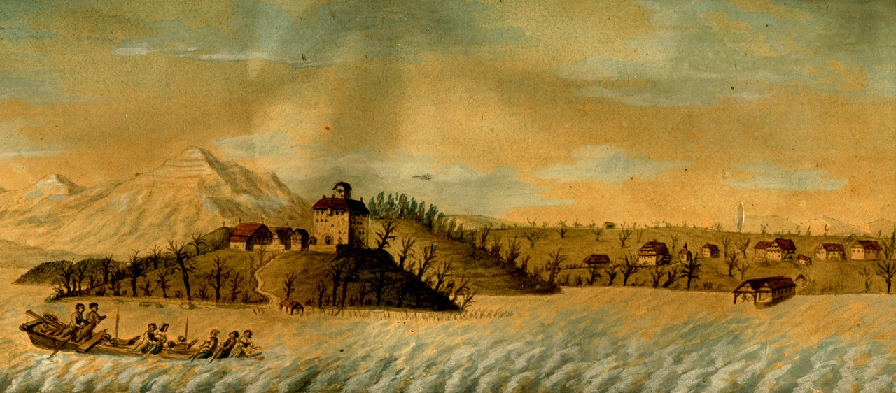

## Relevante Ereignisse und Personen

### Die Baronin von Krüdener

Die Baronin von Krüdener, auch bekannt als Juliana von Krüdener, war eine russische Adlige und
Mystikerin, die im 19. Jahrhundert lebte. Sie wurde 1764 in Riga, Lettland, geboren und stammte aus
einer wohlhabenden und einflussreichen Familie.

Juliana von Krüdener war eine tiefgläubige Christin. Sie war bekannt dafür, dass sie Visionen hatte
und sich in ihren Predigten auf diese Visionen stützte. Sie trat auch als Autorin auf und verfasste
mehrere Bücher über ihre spirituellen Erfahrungen und ihre Visionen.

Juliana von Krüdener wurde von vielen Menschen als Heilige verehrt und ihre Predigten und Bücher
waren sehr populär. Sie reiste viel und hielt Predigten in ganz Europa, darunter in Deutschland,
Österreich, Frankreich und Italien.

*Juliane von Krüdener und ihr Sohn Paul*

Im Jahr 1816, während der Hungersnot, teilte die Baronin von Krüdener ihr gesamtes Vermögen
unter den Armen auf und machte ihr Landhaus in Württemberg zu einem spirituellen Zentrum. Von
dort aus reiste sie in den Jahren 1816 bis 1818 durch Baden, das Elsass und die Nordschweiz, wo sie
die biblische Rolle der Frau als Retterin des Volkes betonte, als Krankenheilerin auftrat und
Suppenküchen für die durch die Napoleonischen Kriege schwer geplagte Bevölkerung betrieb. Dabei
nutzte sie die Gelegenheit, um vor Tausenden ihre religiösen Ideen zu verkünden. Sie bewegte die
Massen derart, dass sie sowohl aus Süddeutschland als auch aus Basel als subversiv für das Land
betrachtet wurde und unter polizeilicher Aufsicht nach Russland deportiert wurde. Nach ihrer
Ankunft in Russland im Jahr 1818 versuchte sie, Einfluss auf den Zaren zu nehmen, der jedoch
inzwischen von ihr abgerückt war und sie nicht mehr empfing. Sie starb im Dezember 1824 im Krim.

### Welche Katastrophen tauchten weiterhin auf?

Die Hungersnot, die 1817 in der Schweiz wütete, war bereits schlimm genug. Sie wurde aber noch
schlimmer. Im Winter desselben Jahres brachen Lawinen aus, die Tannen- und Buchenwälder
zerstörten und sogar ganze Häuser samt ihren Ställen voller Gras und Vieh begraben. Die Lawinen
vernichteten auch Ernten von Obst und Gemüse, was die Not der hungernden Bevölkerung noch
vergrösserte.

Das Jahr 1816 hatte bereits Hagelschäden gebracht, die die Ernten zerstörten und dazu führten, dass
im Jahr darauf noch mehr Menschen hungern mussten.

Im Frühling 1817 kamen dann Überschwemmungen hinzu, als der Rhein und der Bodensee über die
Ufer traten. Diese Überschwemmungen wurden verursacht durch die ungewöhnlich warme
Witterung, die dazu führte, dass Gletscher schmolzen und Wasser in die Flüsse leiteten.
Es war eine Zeit voller Leiden und Elend in der Schweiz, und die Menschen waren gezwungen, alle
Kräfte zu mobilisieren, um zu überleben. Die Hungersnot, die von anderen Katastrophen begleitet
wurde, hinterliess tiefe Spuren in der Geschichte des Landes und zeigt, wie schwer es sein kann, sich
gegen die Naturgewalten zu behaupten.

*Seekatastrophe an Weihnachten*

### Quellen:

- <https://de-academic.com/dic.nsf/dewiki/141640>
- <https://daten.digitale-sammlungen.de/0001/bsb00016330/images/index.html?seite=111>
