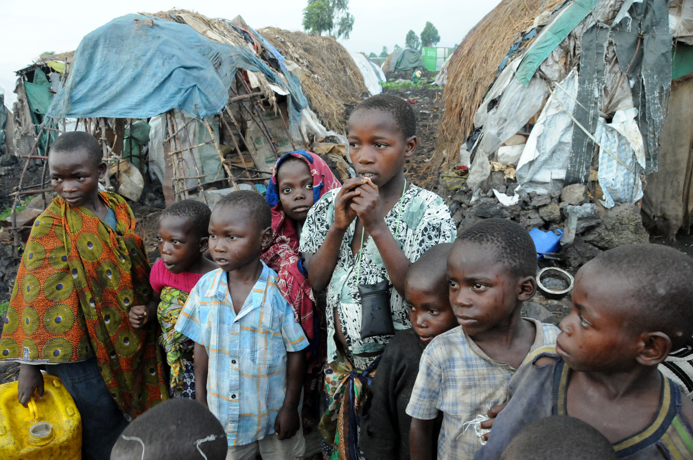

# Voraussetzungen für eine Hungersnot und ist sie vergleichbar mit heutigen Hungersnöten?

## Wie kann ein Land bzw. eine Region heute in eine Hungersnot stürzen?

Einer der häufigsten Gründe ist Krieg. Durch Krieg werden Importe von Nahrungsmittel abgeschnitten und es ist fast unmöglich, Landwirtschaft zu betreiben. Felder werden zerstört und man hat nicht genug Ressourcen, um Tierhaltung zu ermöglichen.

Ein Grund, den man oft in Afrika wiedererkennt, wären schlechte Wetterbedingungen/Naturkatastrophen. Durch unregelmäßige Trocken-/Regenzeiten können Felder zerstört werden. Tierhaltung ist für viele Dörfer zu teuer.

Wie man sieht, ist Armut auch ein großer Faktor. Dies ist oft Folge von anderen Gründen, jedoch trifft man Armut fast immer an, wenn man über Hungersnöte redet.

## Ist die Hungersnot der Jahre 1816/17 mit Heutigen Hungersnöten vergleichbar?

Als erstes Definieren wir, was eine Hungersnot ist, um dann die sogenannte Hungersnot von 1816/17 mit heutigen Hungersnöten vergleichen zu können. Die Definition einer Hungersnot entnehmen diese der IPC-Skala, diese ist dient uns als Anhaltes Punkt, um Hungersnöte zu definieren. Sobald ein Land oder eine Region in dieser Skala die Stufe fünf erreicht hat, kann man von einer Hungersnot sprechen. Die Stufe fünf hat ein Land dann erreicht, wenn über 20% der Haushalte einen völligen Mangel an Nahrungsmitteln haben, über 30% an Unterernährung leiden und pro Tag 2 von 10’000 an den Folgen der Unterernährung erlegen.

Nach den Beschreibungen von Peter Schetilin Lied der Großteil der Bevölkerung der Ostschweiz an einem Nahrungsmittelmangel und an Unterernährung Appenzell verlor 6 % seiner Bevölkerung an den Hunger. Dem nach zu urteilen kann man wahrlich von einer Hungersnot im Heutigen sinne sprechen.

*Bild von hungernden Kinder im Kongo*