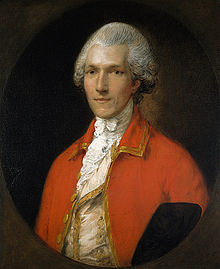
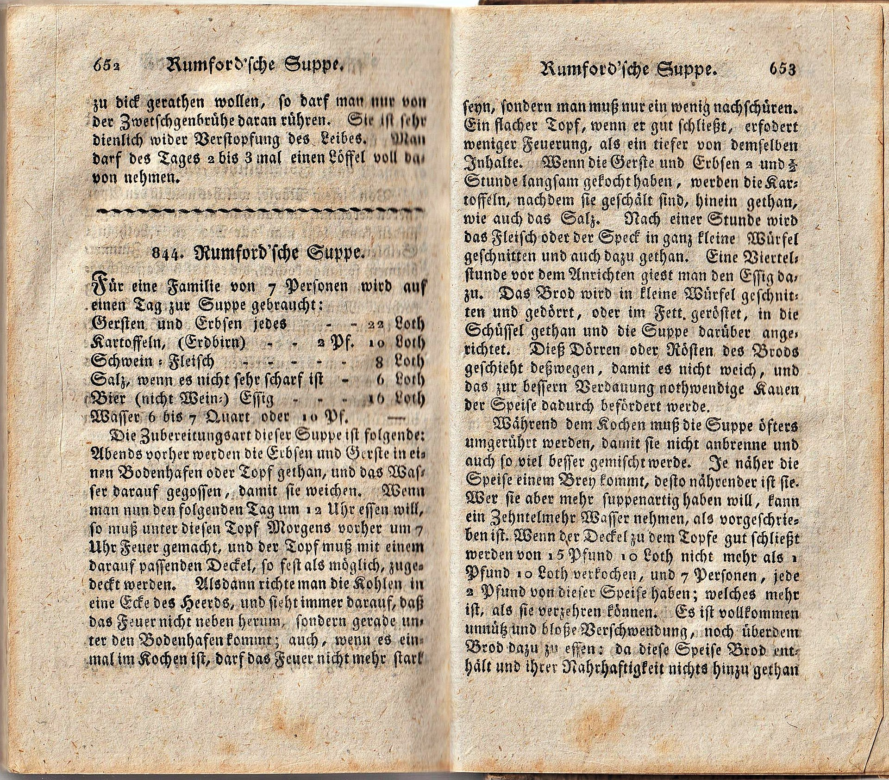
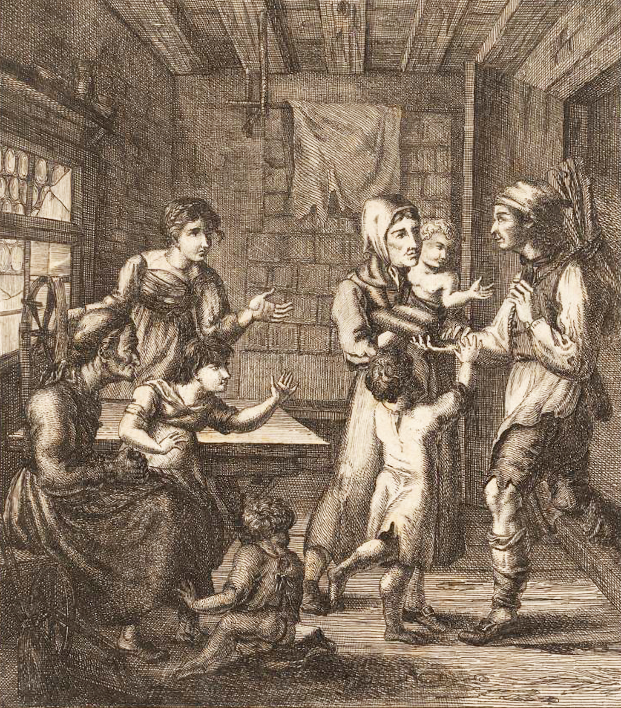
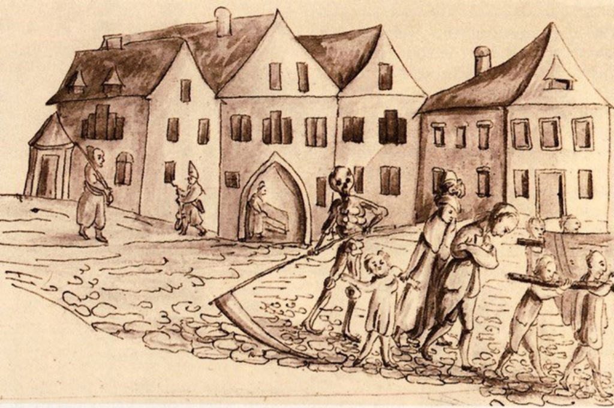

# Nahrungsgrundlagen und Gesundheit

## Die Rumfordische Suppenausteilung

Die Austeilung von Suppe fing im November 1816 an. Die Suppe wurde nach Rumford benannt. Der König machte Rumford zum Ritter, da er im Krieg gegen Amerika viele Kenntnisse bewies.

*Benjamin Thompson Reichsgraf von Rumford*

Die Suppe bestand aus Erbsen, Gerste, Kartoffeln, Essig und Salz und wurde in den Hungerjahren besonders wichtig. Die Rumfordische Suppe wurde allen Bettlern in Zwangsarbeitsanstalten ausgeschöpft. Der Erlös aus den Arbeiten in den Zwangsarbeitsanstalten kam der Anstalt zugute, reichte aber nicht lange aus. Lügende und faule Bettler wurden sehr hart und skrupellos behandelt. Verwundete wurden in der Medizinanstalt betreut.

*Zeitgenössisches Rezept zur Rumfordsuppe*

Leider gab es auch in diesen Anstalten zu wenig Arbeit und schlechter Lohn. Das Futter und Heu wurde knapp, da immer mehr Schnee fiel und die Vorräte zu Ende gingen. Bald wurde nicht mehr an die Leute, sondern nur noch an die Tiere gedacht.

In der Frühlingszeit wurden viele Beeren, Kräuter und Schnecken gesammelt, die aber nicht viel nährten. Es wurde alles gegessen was man früher nicht mal den Schweinen zum Essen gab. Sogar Blut wurde von der Metzgerei geholt und verzehrt. Die Rumfordische Suppe wurde mithilfe des papinischen Topfes für die Armen verbessert. Mit diesem Topf konnten Knochen und Elfenbein erweicht werden. Durch diese Erfindung kamen weitere Essensquellen auf.

## Hundshunger

"Ein Schumacher war auf seiner Arbeit vor Müdikeit plötzlich zusammengesackt", so könnte es in der Zeitung stehen. Der Mann hatte Hundshunger. Ein Hunger, der seinem grässlichen Name alle Ehre machte. Die wenige Nahrung, die er bekommen konnte verschlang er mit einer Gierigkeit, für die er sich selbst schämte.

*Neujahrsblatt der Zürcherischen Hülfsgesellschaft von 1817: Eine hungernde Familie erwartet den mit Essen heimkehrenden Vater.*

## Nervenfieber

Das Volk litt unter ungesunder Nahrung, an dem regelmässigen Witterungswechsel sowie an Veränderungen der Luft. Dadurch kam eine Seuche hervor, das sogenannte Nervenfieber. Sehr viele Menschen mussten unter den Folgen dieser Krankheit leiden. Die jungen Leute konnten im Gegensatz zu Älteren sehr viel ertragen. Um gegen die Seuche standzuhalten, benutzten viele Menschen Sicherungsmittel. In Krankenhäuser wurden Essigdämpfe eingesetzt. Leute auf dem Land wurden deutlich vernachlässigt und somit verstarb eine grosse Menge an Bürgern.

*Illustration zum schrecklichen Nervenfieber*